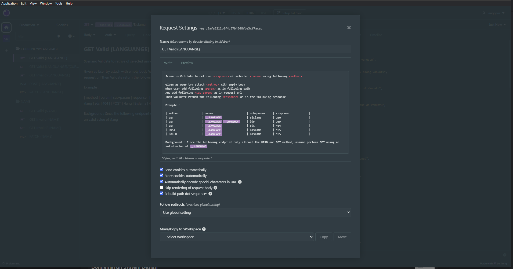
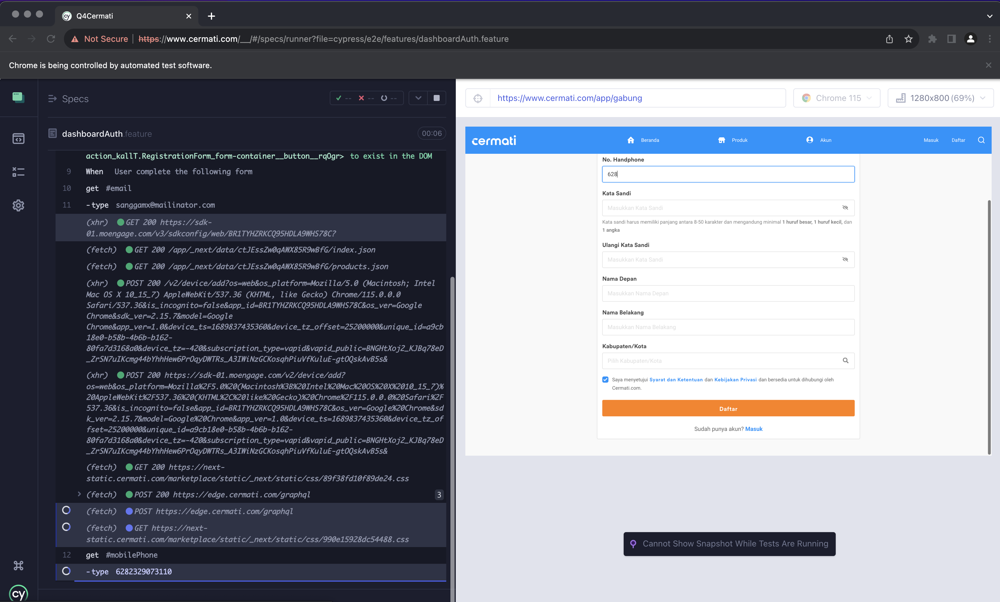
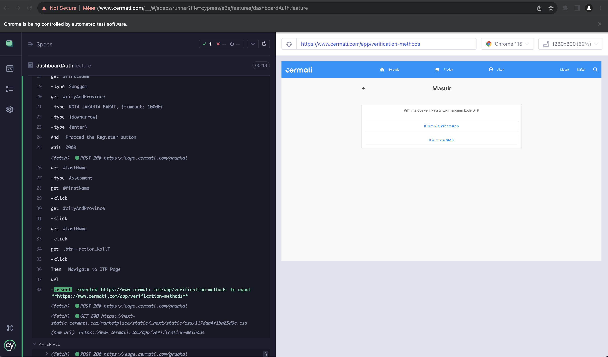
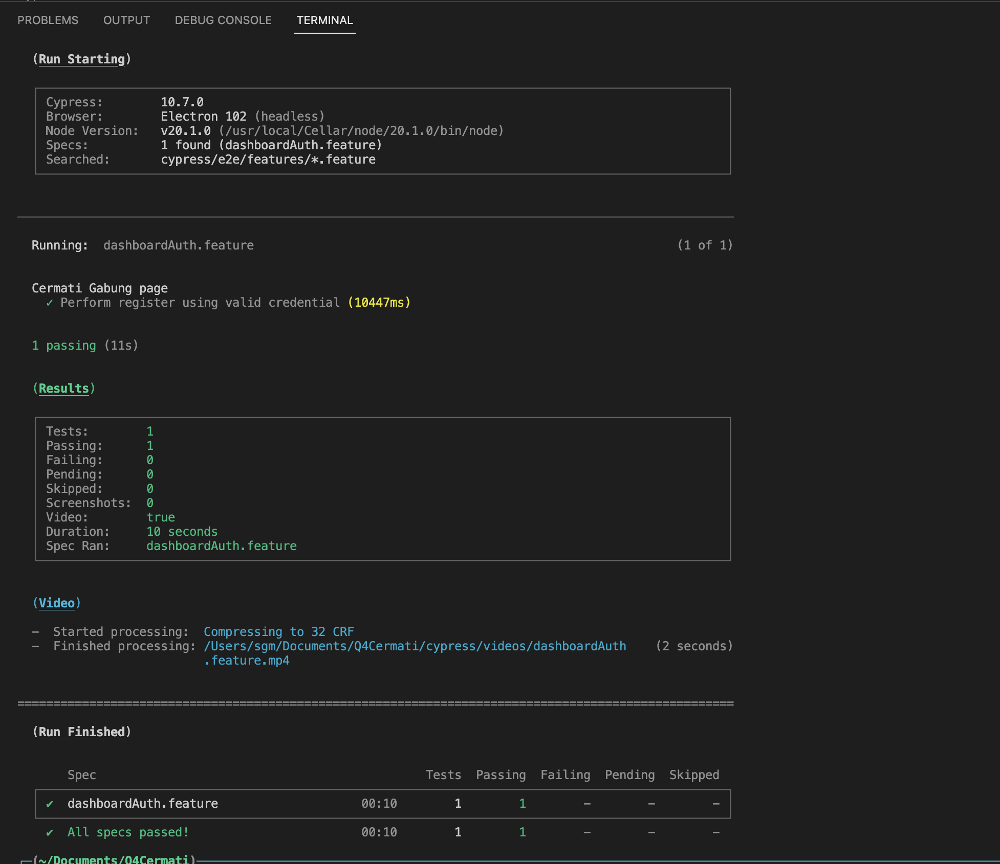

# BDD + Cypress Web Automation

Previously already completed the assessment as in the following link :

Q1 : [ git@gist.github.com:217dbaa5f5fbe21e18959603f057daf8.git](https://gist.github.com/purrarri/217dbaa5f5fbe21e18959603f057daf8)

Q2 : [ git@gist.github.com:995542393b6ce9f47f3335e93cf86e5b.git](https://gist.github.com/purrarri/995542393b6ce9f47f3335e93cf86e5b)

Q3 : [ Endpoint Collection of API](Q3_2023-07-20.json) - Import as to Postman/ Insomnia as the following test cases submitted in Description



Q4 :
```
Are you familiar with Automation testing?If yes, create an automation script using any framework of your choice for the below scenario:• Go to https://www.cermati.com/gabung
•  Enter all required fields (cover only positive cases) and register your account Ifno, canyou code in python or Javascript
```
Automation written in Javascript leveraging Cypress, Gherkin, allure as reporting and POM (Page Object Model).

## Test Environments

- [Dashboard](https://www.cermati.com/app/gabung)
- [OTP Page](https://www.cermati.com/app/verification-methods)


## Prerequisites

- Node.js is installed on your local machine
- ** In order to successfully run all the scenarios, make sure to create a json file called "cypress.env.json" and make sure to fill the credentials needed when you're done cloning the project into your local machine**. Here's how the file content should look like:

  ```
  {
      "registerEmail": "sanggam@mailinator.com"
      "phone_number": "6282329073110",
      "nameForm1" : "Sanggam",
      "nameForm2" : "Assesment",
      "password": "Testing21!",
      "password2": "Testing21!",
      "baseUrl": "https://www.cermati.com/app/gabung",

  }
  ```

To ensure a well-organized structure, I have split the project into three main folders.

- Feature: In this folder, I outline the test scenarios and steps in Gherkin/Cucumber format. Gherkin is a user-readable language that allows stakeholders, developers, and testers to collaborate effectively. It describes the application's behavior in a structured way, making it easier to understand and maintain test cases. Each feature file represents a specific feature of the application under test and contains scenarios and corresponding steps.

- Pages: This folder houses the Page Object Model (POM) files. Each page object represents a page or a component of the application. Within these files, I declare the getters and setters for the elements present on those pages. This approach enhances the maintainability of the tests, as any changes to the application's UI can be localized within the corresponding page object, making the test suite more dynamic and adaptable.

- Step Definitions: The step_definitions folder contains the implementation of each step defined in the feature files. Here, I write the actual code that interacts with the application to execute the tests. These step definitions act as a bridge between the Gherkin scenarios and the Cypress test scripts. By separating the step definitions from the feature files, I ensure a clean and modularized code structure, making it easier to manage and update test cases.

Overall, this project structure and organization help maintain the clarity, reusability, and scalability of the test suite. The BDD approach using Gherkin/Cucumber enhances collaboration between team members and stakeholders by providing a common language to describe the application's behavior. The POM pattern for the pages ensures that any UI changes can be accommodated efficiently, and the step definitions separate the test logic from the scenario descriptions, promoting the maintainability and readability of the test code.

## How to Run The Test in Headless Mode

simply run the following command and sit back and drink your water. The results should come up in a bit.

    npm run headless

## How to Run Test With Cypress GUI

1. Clone this project
2. Open your IDE and terminal
3. Cd to the project directory
4. run the following command to install cypress and the dependencies

```
npm install
```

5. Run npm run test or if that does not work try npx cypress open

```
npx cypress open
```

6. Wait for the Cypress GUI to appear
7. Click the feature scenarios 
8. Once the test is done running, close the tab and Cypress GUIs

GUI report





As in the following another report by screenshot and video, also stored in allure-result

Headless



## Findings

1. Since the following behaviour of selected field Kota/ Kabupaten return as dropdown with dynamic value, and somehow affect the behaviour of button 'Daftar' to visible or not, indicate the folllowing behaviour of selected field its buggy.

2. Since after complete the Register flow, as User will navigate to following page of requesting OTP and the following behaviour of OTP is return as dynamic value, so I would like to propose to bypass the following behaviour of OTP so user can procced complete the register by utilizing faker.js

"# CermatiAssesment25" 
